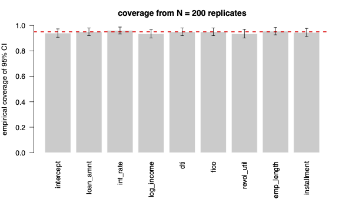

# Bayesian Loan Default Prediction with Custom MCMC

A Bayesian logistic regression for loan default on the Lending Club dataset (1.26M loans). Implements random-walk Metropolis-Hastings from scratch in base R, with adaptive proposal covariance and validation through a 200-replicate simulation study run as a parallel LSF array job on an HPC cluster.

## Results

- 95% credible interval coverage between 0.935 and 0.960 across all 9 parameters in the simulation study
- Bias under 0.005 for every parameter (200 replicates, n = 10,000 each)
- 0.286 mean acceptance rate across replicates (Roberts-Rosenthal optimal: 0.234)
- 8 of 9 credible intervals on the real data fit exclude zero, with signs consistent with credit risk theory



## Technical highlights

- **Custom MCMC implementation in base R.** No external packages — multivariate normal sampling and density evaluation written from scratch using Cholesky factorization.
- **Adaptive proposal covariance.** Updates Σ_prop from the empirical covariance of recent samples, scaled by 2.4²/p following the Roberts-Rosenthal optimal scaling result.
- **Calibration validation.** Simulation study generates 200 synthetic datasets from known true coefficients and checks that 95% credible intervals cover the truth at the nominal rate.
- **HPC parallelization.** Simulation study runs as an LSF array job on NC State's Hazel cluster; total wall-clock time under 10 minutes.

## Stack

- R (base only)
- LSF / bsub for HPC
- LaTeX for the report

## Repo layout

```
.
├── report.pdf              full technical writeup (11 pages)
├── helpers.R               MH sampler + Cholesky-based mvtnorm
├── data_prep.R             raw Kaggle CSV → cleaned dataset
├── run_file.R              one synthetic dataset + MH (per seed)
├── out_file.R              aggregates traces → coverage tables, figures
├── real_data_fit.R         MH on real data → trace plots, posterior summary
├── workflow.sh             serial reproducibility pipeline
└── batch_run.sh            LSF array job for parallel HPC execution
```

## Reproducing

The cleaned dataset is not included in the repo (full Kaggle download is 1.6 GB). To regenerate:

1. Download `accepted_2007_to_2018Q4.csv` from [Kaggle](https://www.kaggle.com/datasets/wordsforthewise/lending-club).
2. `Rscript data_prep.r path/to/raw.csv data/lending_club_clean.csv`
3. `bash workflow.sh` (serial) or `bsub < batch_run.sh` (HPC array)

## Report

Full methodology, simulation results, and interpretation in [`report.pdf`](report.pdf).
